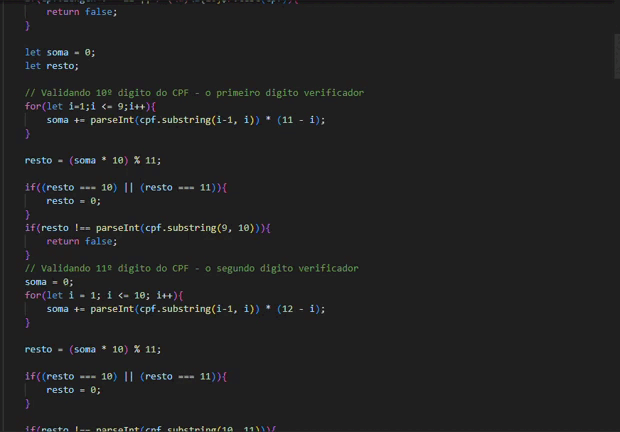

# **Validações de CPF e EMAIL**

O projeto consiste basicamente em criar um código com a capacidade de validar um CPF e um EMAIL e dizer ao usuário se eles estão corretos ou não, usando JavaScript.

# Objetivo

 Aprender uma maneira de criar um campo preenchível com validação de email e CPF utilizando JavaScript
## Validação de email

### **Esse é o código utilizado para a validação do campo de email, que utiliza métodos para verificar se o que o usuário inseriu no campo é um email da seguinte forma:**

* Verificar se o campo está vazio, caso esteja, um alert escrito que o campo deve ser preenchido.

* Verificar se o que o usuário inseriu possui o caractere "@" e ".", se possui é um email, caso ao contrario um alert notificando que o que o usuário digitou não é um email válido.

## Validação de CPF

### **Esse é o código para validar se o CPF é um CPF existente, seguindo esse passo a passo:**

* Remover caracteres não numéricos: O CPF é composto por 11 dígitos, mas geralmente é apresentado com pontos e traços. Esses caracteres não numéricos devem ser removidos

* Verificar se todos os dígitos são iguais: Um CPF com todos os dígitos iguais (como "111.111.111-11") é inválido.

### Cálculo do primeiro dígito verificador:

* Considere os primeiros 9 dígitos do CPF.
* Multiplique cada um dos 9 dígitos pela sequência decrescente de 10 a 2 e some os resultados.
* Calcule o resto da divisão da soma por 11.
* Se o resto for menor que 2, o primeiro dígito verificador é 0. Caso contrário, subtraia o resto de 11 para obter o primeiro dígito verificador.

### Cálculo do segundo dígito verificador:

* Considere os primeiros 9 dígitos mais o primeiro dígito verificador.
* Multiplique cada um dos 10 dígitos pela sequência decrescente de 11 a 2 e some os resultados.
* Calcule o resto da divisão da soma por 11.
* Se o resto for menor que 2, o segundo dígito verificador é 0. Caso contrário, subtraia o resto de 11 para obter o segundo dígito verificador.
* Comparação dos dígitos verificadores: Verifique se os dígitos verificadores calculados correspondem aos dois últimos dígitos do CPF fornecido. Se corresponderem, o CPF é válido; caso contrário, é inválido.

# **Resultado do verificador de email**

# **Resultado do verificador de CPF**

### Autores

* Ricardo Siena